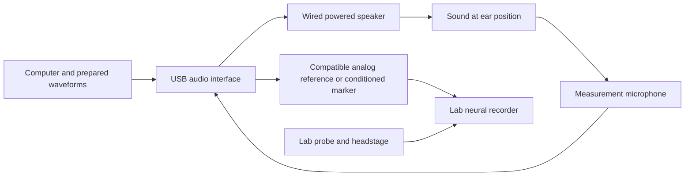

# Auditory hardware options and budget

October 9, 2026. **A computer, wired powered speaker and measurement microphone can support a much cheaper audible-sound setup.** For cortical measurements, retain the lab's neural recording system and connect sound timing to its recording timeline. The NI rack in the supplied slides is one implementation, not a requirement for every auditory experiment.

The lowest priced three-part audio basket found is **$264.90 before accessories, delivery and tax**. About **$425** is a conditional starting budget if the lab supplies the computer, neural recorder, SPL reference and compatible timing connection. A more useful audible-sound working budget is **$1,100–1,600** with reference/timing allowances. These options cover selected audible tones, not the complete SONIC frequency alphabet or the slides' ultrasound capability.

## Budget choices

All totals are USD for one sound stimulus channel. They exclude neural probes/headstages/recorders, animal preparation, institutional services and integration labor. Existing lab probes are the established scope; exact recorder/accessory availability remains open. The low and high columns describe different purchase/allowance combinations, not guaranteed market bounds.

| Option | Lower planning total | Higher planning total | What the total assumes |
|---|---:|---:|---|
| Minimum audible setup | $424.90 | $424.90 | Existing PC and recorder, borrowed SPL reference and already compatible timing input |
| Practical audible setup | $1,114.90 | $1,596.87 | Existing PC/recorder; $300–400 toward SPL-reference access; $250–350 toward a timing interface |
| USB higher-frequency candidate | $11,004.90 | $20,251.98 | USB-6361 replaces rack; ES1/ED1, filtered Avisoft microphone, calibration and support |
| Full slide rack candidate | $15,800.49 | $29,469.33 | Both NI modules and rack links, plus speaker, driver/power, microphone, calibration and support |

**For discussion: reserve about $1,500 for an audible first setup, or about $30,000 for the higher-cost slide architecture.** The latter is an upper planning scenario for the defined sound scope, not a hard maximum. ES1 availability, the compatible PXI-4461 version, calibration quotes, or missing recording equipment can change it. An all-new rack or specialist metrology chain can cost more.

The [complete seven-page PDF](output/pdf/Auditory_Hardware_Options_2026-10-09.pdf) and [standalone editable LaTeX source](output/pdf/Auditory_Hardware_Options_2026-10-09.tex) include the parts lists, four budget options, technical limits and clickable sources. The [editable budget](outputs/01a11dcd-7193-7620-9381-3678488ff8ee/Sound_Setup_Budget_2026-10-09.xlsx) contains formulas, quantities, listing links and all allowances. The [price inputs](sources/Sound_Hardware_Prices_2026-10-09.json) distinguish observed asking prices from estimates. Do not add the alternative baskets together.

## The minimum parts list

| Part | Quantity | Observed eBay asking price | Why it is needed |
|---|---:|---:|---|
| [Behringer UMC204HD](https://www.ebay.com/itm/267676379715) | 1 | $97.98 new | Converts computer waveforms to analog sound and records an analog measurement microphone |
| [JBL 305P MkII](https://www.ebay.com/itm/316907728739) | 1 | $99.99 used | Wired powered speaker; amplification is already built in |
| [Dayton EMM-6](https://www.ebay.com/itm/221495576606) | 1 | $66.93 new | Measures sound response at the intended ear position |
| Computer and lab neural recorder | Reuse | $0 incremental assumption | Computer runs playback; neural hardware records the cortical response |
| XLR mic cable, wired speaker cable, USB cable and fixed mounts | 1 set | $80 allowance | Connects the equipment and holds repeatable geometry |
| Delivery/tax reserve | 1 | $80 allowance | Houston delivery and applicable tax are not yet quoted |
| **Minimum total** | | **$424.90** | Requires access to an SPL reference and a compatible timing connection |

The listings displayed purchase controls when checked. The JBL seller states functional condition but offers no returns; the UMC and EMM-6 listings are new. These are asking-price observations, not reserved stock or independent hardware tests. Some retrieved eBay pages use cached delivery dates or a different destination; shipping displayed for another ZIP/country is not a Houston quote.

The practical budget substitutes a [MOTU M4 at $279.95 new](https://www.ebay.com/itm/165277457274) in its high column. That raises the three-part equipment subtotal to $446.87. Its remaining allowances are $100–150 cables/mounts, $300–400 reference access, $250–350 recorder timing and $200–250 delivery/tax/uncertainty. Reference access may mean borrowing or rental; that allowance is not an offer for a new traceable calibrator or a full calibration service.

The UMC204HD has phantom-powered microphone inputs and up to 24-bit/192 kHz operation. The powered JBL is specified at 49 Hz–20 kHz ±3 dB, and the EMM-6 at 18 Hz–20 kHz. Those specifications support an **audible-band candidate**, subject to measurement of the selected tones, output level and geometry. Sampling at 192 kHz does not turn a 20 kHz speaker/microphone chain into an ultrasonic system. [Behringer](https://www.behringer.com/en/products/0805-AAS), [JBL](https://jblpro.com/en-US/products/305p-mkii?hl=en-US), [Dayton](https://www.daytonaudio.com/product/911/emm-6-electret-measurement-microphone).

An even smaller acoustic-development purchase is a [UMIK-1 USB measurement mic, $148.95 new](https://www.ebay.com/itm/222334350764), if a wired speaker and computer already exist. The listing displayed $12.95 shipping, destination dependent. This is convenient for acoustic calibration, but its clock is independent of the playback interface and neural recorder. It is not by itself a synchronized cortical-recording setup. [UMIK-1 specifications](https://www.minidsp.com/products/acoustic-measurement/umik-1/), [REW clock-mismatch guidance](https://mail.roomeqwizard.com/help/help_en-GB/html/makingmeasurements.html).

## How the inexpensive system connects

The microphone records sound; the lab probe and recorder record neural voltages. Keep microphone input monitoring disabled during playback to avoid a feedback loop. Hold analog gains fixed and disable automatic gain/noise suppression or sound enhancement. Use a physical input/output check on the selected computer and drivers.

The preferred economical arrangement uses the analog EMM-6 and an electrical playback monitor on the same audio interface. Reserve an independent physical output for a waveform/reference recorded by a compatible auxiliary analog input on the neural recorder, or use a properly conditioned marker for a compatible digital input. **Audio line output is not TTL and should not be connected as though it were.** The recorder model determines voltage, impedance, connector and grounding requirements.

A software playback timestamp, or an interface's internal digital loopback, does not measure sound arrival at the ear. Record repeated shared markers or an appropriate analog reference, measure acoustic onset, and check drift between the audio and neural clocks. Even modules in a common rack need an explicit synchronization plan. [Psychtoolbox playback timing](https://psychtoolbox.org/docs/PsychPortAudio-Start), [physical latency test](https://psychtoolbox.org/docs/AudioFeedbackLatencyTest), [Open Ephys synchronization](https://open-ephys.github.io/gui-docs/Tutorials/Data-Synchronization.html).

The EMM-6's individual frequency-response file does not, by itself, establish absolute SPL after microphone-preamp gain changes. Calibrate the complete gain chain against a suitable level reference, then measure every selected tone at the intended position. A one-frequency calibrator also does not prove broadband ultrasonic accuracy. [REW calibration guidance](https://mail.roomeqwizard.com/help/help_en-GB/html/calsoundcard.html).

## What the slides contain

The supplied [system diagram](sources/hardware_slides_2026-10-09/01_system_diagram.png) and [equipment links](sources/hardware_slides_2026-10-09/02_equipment_links.png) show the following sound/control architecture. Their Neuropixels link describes a separate neural-acquisition system.

| Slide item | Role | Needed for the inexpensive audible path |
|---|---|---|
| PXIe-1082 | Powers and holds NI modules | No |
| PCIe-8361, PXIe-8360 and MXI cable | Connect a desktop PC to the NI rack | No |
| PXIe-6363 | Analog/digital I/O and hardware timing | Replace with suitable audio I/O and a verified recorder timing path |
| PXI-4461 | High-quality analog sound output/input | Replace for the selected audible band |
| SHC68-68-EPM and BNC-2090A | Expose the NI card's connectors | No, unless using that NI card |
| TDT ED1 | Drives the ES1 electrostatic speaker | Omit when using a conventional powered speaker |
| TDT ES1 | Higher-frequency free-field speaker | Replace for audible-only work |
| Neuropixels module | Neural acquisition, separate from sound playback | Use the existing lab recording system; no new Neuropixels purchase assumed |

The [Neuropixels brochure](https://1d1204a4-e092-4bd5-ab7d-6d350a74299f.filesusr.com/ugd/328966_790b2b46eceb4e6db0ad41aaef2b3364.pdf) names PXIE_1000 and CBL_1000, with probes/headstages and chassis/interface dependencies. It is not a complete sound-system bill of materials. [Official system options](https://www.neuropixels.org/system1-0).

## Prices for the slide architecture

One each. Item prices exclude shipping and tax. The cheaper alternatives with conflicting model/brand information, stale availability, ended listings or parts-only condition are excluded from the totals.

| Item | Observed eBay price | Condition or purchase dependency |
|---|---:|---|
| [NI PXIe-1082](https://www.ebay.com/itm/406923647348) | $2,650.00 | Used; lower overseas listing; a [domestic example](https://www.ebay.com/itm/327362567074) is $6,495 |
| [NI PXIe-6363](https://www.ebay.com/itm/335905594499) | $2,495.36 | Used; seller claims tested |
| [NI PXI-4461](https://www.ebay.com/itm/287382668232) | $571.33 | Used; **hybrid-compatible version not established** |
| [NI PXIe-8360](https://www.ebay.com/itm/286812339947) | $493.20 | Used; correct PXIe model needed |
| [NI PCIe-8361](https://www.ebay.com/itm/187559567628) | $197.00 | New seller claim; exact identity to confirm |
| [MXI 779500-03](https://www.ebay.com/itm/307193912690) | $89.85 | New seller claim; 3 m |
| [SHC68-68-EPM](https://www.ebay.com/itm/277089841525) | $89.99 | Used; 2 m; one connector bank |
| [BNC-2090A](https://www.ebay.com/itm/358482820683) | $613.77 | Used; seller claims working |
| **NI items subtotal** | **$7,200.50** | A conditional collection of listings, not a verified compatible bundle |
| [ED1, HB7, PS25F and zBus chassis bundle](https://www.ebay.com/itm/156873696386) | $209.06 | Used; seller claims tested; fair cosmetics/rust; ES1 and accessories absent |
| ES1 plus matching speaker cable | **$1,500–2,500 estimate** | No reliable current eBay speaker price found; quote/borrowing needed |

The ED1 bundle includes power, so do not add a second power chassis. If the surplus bundle is unavailable, the higher scenario reserves **$3,500 for ED1 plus compatible power**, an estimate rather than a manufacturer price. Reject the [other $495 bundle](https://www.ebay.com/itm/236075052961) as a functional-system price because its condition is parts/not working.

The slides omit a sound-measurement microphone. Both higher-frequency budgets add **one Avisoft 40026 kit at $2,580 manufacturer list**, using the selected NI device as the acoustic ADC. This kit includes microphone, preamplification, polarization, adjustable anti-aliasing filter, cables and mini tripod; do not also add the $8,160 complete 116Hm recorder kit. Provide external 5 V/52 mA and verify gain, filter, input configuration and timing. The $1,500–3,000 calibration and $750–1,500 support allowances remain estimates. [Avisoft price list](https://avisoft.com/price-list-ordering-information/), [external-acquisition kit](https://avisoft.com/ultrasound-microphones/cm16-cmpa/).

The full-rack lower subtotal is $13,739.56, plus a 15% shipping/tax/uncertainty reserve = **$15,800.49**. The higher subtotal is $25,625.50, plus 15% = **$29,469.33**. It uses the $6,495 chassis, $3,500 replacement driver/power allowance, $2,500 ES1 allowance, $3,000 calibration, $1,500 support and $1,500 computer allowance. The remaining NI and Avisoft prices stay the same. The 15% reserve is not a tax rate; do not add displayed shipping again unless replacing the reserve with actual charges.

## Compatibility and frequency limits

**ES1 needs an electrostatic driver.** A laptop or USB interface cannot directly drive it. In the pictured chain, retain ED1 and compatible zBus power; some integrated TDT systems, such as RZ6, provide the electrostatic drive themselves. ES1 is specified at **4–110 kHz, ±11 dB**. TDT cautions against signals below 4 kHz because of distortion and speaker degradation. It is therefore a poor single-speaker choice for low-frequency sheep tones. [ES1 manual](https://www.tdt.com/docs/hardware/ec1-es1-electrostatic-speaker/), [ED1 power requirements](https://www.tdt.com/docs/hardware/ed1-electrostatic-speaker-driver/), [RZ6](https://www.tdt.com/docs/hardware/rz6-multi-i-o-processor/).

**The slide source does not cover the entire 110 kHz speaker specification.** PXI-4461 tops out at 204.8 kSa/s, with specified flat output through 92.1 kHz at that rate. Its Nyquist boundary is 102.4 kHz. The USB-6361 option has a higher-rate waveform source, but the complete analog/speaker/microphone chain must still be measured. [NI 4461 specifications, printed pp.17–19](https://docs-be.ni.com/bundle/ni-4461-4462-specs/raw/resource/enus/373770k.pdf), [USB-6361](https://www.ni.com/en/shop/hardware/voltage/model-usb-6361).

**Confirm the PXI-4461 rear connector before buying.** NI sold standard PXI and hybrid-compatible versions under the same model name. Only the appropriate hybrid version works in the PXIe-1082's hybrid peripheral slots. Also confirm one versus two DAQ breakout banks, an available desktop PCIe slot, and supported drivers. [NI variant explanation](https://knowledge.ni.com/KnowledgeArticleDetails?id=kA00Z000000P8eUSAS), [chassis manual](https://docs-be.ni.com/bundle/pxie-1082-seri/raw/resource/enus/372752c.pdf), [cable compatibility](https://www.ni.com/en/support/documentation/cable-accessory-guide/daq-multifunction-i-o-cable-accessory-compatibility/main-page---daq-multifunction-i-o-cable-and-accessory-compatibil/63xx-models.html).

**A USB DAQ can remove the rack without removing the higher-frequency sound chain.** A new [USB-6361 781442-01 at $3,030.42](https://www.newark.com/ni-now-part-of-emerson/781442-01/multifunction-i-o-device-usb-6361/dp/14AJ5341) can supply waveform/acquisition/events, avoiding the PXIe chassis, both MXI cards, MXI cable and PXI sound card. This is a candidate architecture, not a tested software drop-in. Its screw-terminal version still needs connection wiring included in support allowances. NI supports text-language programming through NI-DAQmx; LabVIEW purchase is not inherently required. [NI software options](https://knowledge.ni.com/KnowledgeArticleDetails?id=kA00Z000000kFD7SAM&l=en-US).

## Decision for our experiment

Start by agreeing on the stimulus frequency range. **Selected audible tones can justify the inexpensive audio basket.** Full SONIC replication cannot: the paper's initial set spans approximately 1.4–32 kHz, and the refined set includes tones through 27 kHz. A 20 kHz chain excludes part of those alphabets; the ES1 also excludes their low-frequency end. SONIC used USB-6361, SA1 and MF1, not this slide's ES1 chain. For the full paper range, retain the [MF2/SA1 candidate](Mouse_Setup_Equipment_Plan.md) or another measured compatible speaker/measurement route, with a microphone suited below 2 kHz. See [paper methods notes](Paper_Notes.md).

Identify the exact lab recorder and its auxiliary analog/digital inputs before choosing a timing adapter. Inventory borrowed speakers, microphones, level references, DAQs and TDT units before buying duplicates. Then verify selected-tone SPL/response, distortion, repeatable geometry, physical acoustic onset and clock alignment on the bench. Keep the software/waveforms and configuration with the captures.

Rice's primary measurements remain in **sedated sheep**. Hardware feasibility does not establish response windows, decoding accuracy or ITR under sedation. A soundproof box and behavioral rig are not required by [team direction](sources/Team_Clarifications_2026-10-07.md); background sound, acoustic geometry and calibration still matter. This equipment comparison is a planning record, with no completed bench or animal validation.
