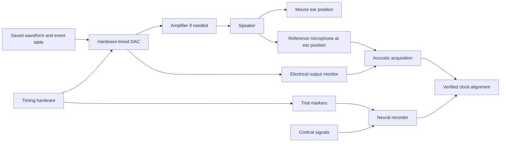

# Mouse auditory stimulus setup proposal

October 8, 2026, America/Chicago. Howard requested a mouse adaptation to consider alongside his review of SONIC's methods. Start by defining and checking the sound, acoustic measurement, and recording-timing paths on the bench. Then characterize responses to separated tones before exploring rapid sequences.

This is a proposed engineering design. The confirmed primary Rice target remains sedated sheep. Howard confirmed on October 8 that awake versus anesthetized/sedated mouse state is still undecided; mouse strain/age, recorder, and local equipment are also open decisions. The design does not select an animal exposure schedule or anesthesia procedure.

Howard also clarified that we will use the lab's own probes and focus this work on the sound setup. The purchase budget covers sound delivery, measurement, calibration, and timing connections; neural and animal-preparation hardware are outside it. Exact lab recorder/headstage interfaces still need confirming.

The intended design is a mouse sound setup whose equipment can later be reused for the primary sedated-sheep work. Transfer requires fresh acoustic calibration at the sheep-ear position, appropriate frequency/level choices, and timing checks with that recording system. It is not a demonstrated cross-species protocol; see the [equipment rationale and transfer plan](Mouse_Setup_Equipment_Plan.md).

## What transfers from SONIC

The source is the unchanged [SONIC bioRxiv v1 manuscript](sources/SONIC_2025_bioRxiv_v1.pdf), printed pp.11-13, Sections 6.1-6.6. [Paper notes](Paper_Notes.md) retain the full method ledger and unresolved details.

| SONIC method | Implication for the mouse design |
|---|---|
| Sine-wave pips with zero starting phase and 2 ms amplitude ramps at each end. | Save the exact waveform definition. The paper does not identify ramp shape, so any chosen shape is an explicit Rice choice. |
| Entire waveform generated in advance; NI USB-6361 output at 192 kHz. | Propose precomputed blocks with hardware-timed playback and a saved event table. Select output hardware from its real bandwidth, clocking, buffering, and available lab interfaces. |
| SA1 amplifier and MF1 free-field speaker; approximately 80 dB SPL at sheep-ear distance. | Assess local speaker, amplifier, microphone, and geometry. The paper's level is a reference setting, not a selected mouse level. |
| Random frequencies balanced within blocks; benchmark tones last 10 ms with no silence between tones. | First establish local tone responses and sequence effects; rapid playback is a later question. The published schedule is not a mouse validation. |
| PTP and a 10 MHz reference; sound-output voltage and trial-start edges captured electrically. | Identify the recorder's actual event and clock interfaces. Add measured acoustic onset at the ear reference position; the reported electrical scheme does not establish local acoustic timing. |
| Main analysis uses neural features from 10-60 ms after tone onset; animals are awake and alert. | Select response windows from the intended mouse recording modality, site, and animal state. The sheep analysis window is a starting question, not a mouse specification. |

## Proposed sound and timing paths

The microphone measures delivered sound; the neural recorder measures brain activity. Their records must share a verified time relationship. This diagram expresses functions, not an approved wiring map. Establish input voltage limits, grounding, bandwidth, and clock support before specifying connections.

If the neural recorder can capture the required acoustic bandwidth, a common acquisition clock may simplify alignment. Otherwise use a suitable acoustic acquisition device with a validated clock relationship to the neural recorder. A slow neural auxiliary input cannot be assumed to capture an ultrasonic waveform correctly.

## Mouse decisions that affect the design

**Strain and age.** Record the actual mouse background, genotype, age, and available hearing information. Bowen and colleagues found differences in cortical frequency representation and sound-level sensitivity between the tested adult C57BL/6 and CBAxC57 F1 groups; their paper also discusses high-frequency hearing loss with age in C57BL/6 mice. This supports checking the actual animals rather than selecting a generic mouse frequency range. It does not select a strain for Rice. [Bowen et al. 2020](https://www.nature.com/articles/s41598-020-67819-4).

**Animal state and recording modality.** Keep awake and anesthetized/sedated preparations explicit. Guo and colleagues found that cortical frequency-map organization persisted across their tested states while temporal and tuning properties changed. Determine local response timing under the intended state, and establish whether the recording measures extracellular potentials, calcium signals, or another signal before borrowing a decoder window. [Guo et al. 2012](https://www.cmu.edu/dietrich/psychology/shinn/publications/pdfs/2012/2012jneurosci_guo.pdf).

**Frequency coverage.** A small, coarse set is useful for the first hardware discussion. For example, 4, 8, 16, and 32 kHz are an illustrative bandwidth checklist, not a selected mouse stimulus alphabet. Actual choices depend on the animals, recording site, and calibrated chain. A 48 kHz sample rate has a 24 kHz Nyquist boundary and cannot faithfully represent a 32 kHz tone. The DAC and microphone ADC also need adequate analog bandwidth and practical filter margin; a high sample-rate label alone is insufficient. [NI sampling and bandwidth explanation](https://www.ni.com/en/shop/data-acquisition/measurement-fundamentals/analog-fundamentals/acquiring-an-analog-signal--bandwidth--nyquist-sampling-theorem-.html).

The paper's MF1 speaker is worth checking against local inventory: TDT specifies ultrasonic capability up to 65 kHz and supports free- and closed-field configurations. That does not guarantee flat or sufficient output at every frequency in our geometry. Choose a measured usable range for the whole chain. [TDT MF1 specifications](https://www.tdt.com/product/mf1-multi-field-magnetic-speakers/).

## Calibration and event timing

Measure each candidate frequency at the intended ear reference position with a microphone, conditioner/preamplifier, and ADC that cover the range. Define the level convention and measurement interval for ramped pips; save gain, distance, orientation, spectrum, clipping/distortion checks, and background sound. Equal digital amplitudes can produce different acoustic levels, so any per-frequency adjustment must be supported by measurements. Recheck relevant changes in speaker placement or configuration. TDT's calibration guide illustrates the dependence of calibration on microphone placement and delivery geometry. [TDT acoustic calibration guide](https://www.tdt.com/files/manuals/ABRGuideRA4PA.pdf).

Lan's supplied direction does not require rodent sound isolation. Preserve that direction while measuring room/background conditions and using repeatable geometry. [Team clarification](sources/Team_Clarifications_2026-10-07.md).

Keep these events distinct: playback request, hardware marker, electrical waveform onset, microphone-detected acoustic onset, and recorded neural response. Define clocks, units, channel identities, and onset-detection rules. Measure marker-to-acoustic delay, variability, missing events, and drift under the intended hardware configuration. Account for acquisition/filter delay in the microphone path. TDT documents different digital and converter delays for its devices; its tabulated values cannot be transferred to other hardware. [TDT input and output delays](https://www.tdt.com/files/fastfacts/IODelays.pdf).

## Proposed progression

| Stage | Question to resolve | Evidence needed to move forward |
|---|---|---|
| 1. Inventory and bench design | Can the available chain generate, measure, and timestamp the chosen test waveforms? | Actual model/interface list, connection map, waveform/event specification, and bench criteria. |
| 2. Bench verification | Does the delivered sound match the intended frequency, envelope, level convention, and timing? | Raw electrical/acoustic captures, per-frequency measurements, timing analysis, and documented gaps. |
| 3. Mouse response characterization | Which separated tones produce reproducible responses in the intended state and recorded site? | Team-defined measurement plan, recorded responses, and justified response windows. |
| 4. Sequence characterization | How do prior sounds and shorter intervals change the responses? | Measurements across declared sequence conditions, with stable delivery/timing evidence. |
| 5. SONIC-inspired benchmarking | Can the recording distinguish a declared tone alphabet in held-out sequences? | Fixed stimulus/evaluation definitions, decoding results, error structure, and appropriately defined information rate. |

The progression is our proposal, not a mouse protocol established by SONIC. Phillips and colleagues showed diverse effects of preceding tones on subsequent responses in awake mouse auditory cortex. A clear isolated-tone response therefore does not establish that the tone will remain distinguishable in a rapid train. Their study provides no universal maximum mouse stimulus rate. [Phillips et al. 2017](https://pubmed.ncbi.nlm.nih.gov/28566458/).

Include a recorder-approved bench check with a suitable nonbiological input/load for stimulus- and marker-synchronous electrical pickup before interpreting sound-locked signals as neural responses. The team's later measurement plan should distinguish genuine responses from remaining artifacts.

For later decoding, retain entire contiguous sequence blocks within data partitions when feature windows overlap, select settings without using the held-out test data, and declare preprocessing. With silence between tones, information per tone divided only by tone duration is not the actual elapsed presentation rate; report the interval and rate denominator explicitly. See SONIC Sections 6.4-6.5 and [paper notes](Paper_Notes.md). No mouse response or ITR is measured here.

## Immediate deliverable for Howard and Jiaao

Prepare one equipment-and-interface table containing the existing playback output, amplifier, speaker, calibrated microphone chain, acoustic ADC, and neural recorder. Include actual models, usable frequency coverage, event inputs, clock interfaces, owners, and unresolved gaps. Pair it with this functional diagram and a proposed animal-free calibration/timing check.

The questions that determine the next revision are the mouse strain and age, awake versus anesthetized/sedated state, neural recording modality and event inputs, available speaker and microphone models, and intended delivery geometry. These remain open. The current [inventory](Equipment_Software_Inventory.md) and [bench plan](Bench_Validation_Plan.md) provide the shared record format.
