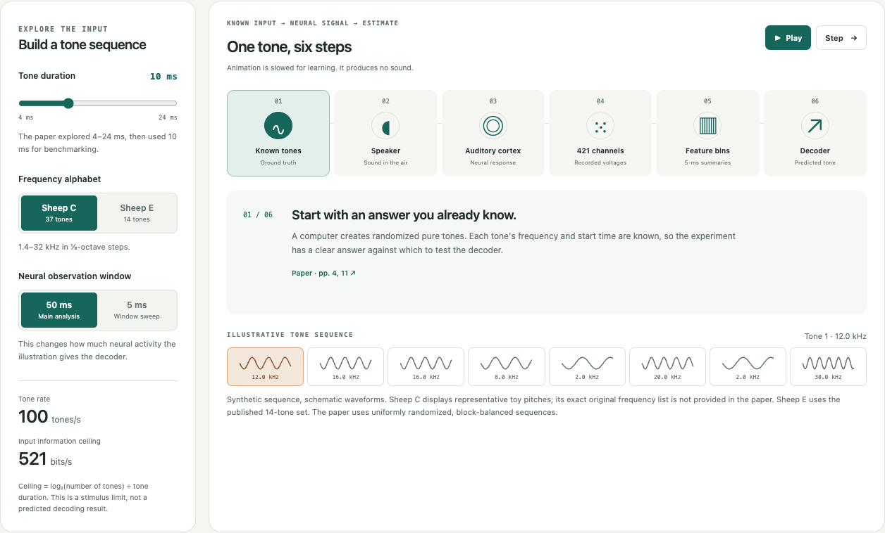

# SONIC Auditory Benchmarking

A shared research workspace for understanding SONIC and designing the auditory stimulus setup for Rice's planned sheep measurements.

**[Open our experiment setup](https://howardwhsrun.github.io/audiotory_benchmark/web/)** · **[Read the paper notes](Paper_Notes.md)** · **[Review the setup requirements](Auditory_Setup_Requirements.md)**

The homepage shows **our planned experiment** in one diagram. Select a component for its role and the choice still open.

**Paper reference** keeps the setup, illustration, and results in collapsed sections. Its activity is synthetic. The site does not play sounds, connect to instruments, or report Rice experimental results.



## Current direction

Lan clarified that the primary purpose is **testing in sheep**, which will be **sedated during the measurements**. The aim is to measure auditory cortical responses to controlled sound stimuli. A soundproof box, behavioral rig, and sound isolation are not required for the planned work. The team should identify the sound delivery and measurement components needed from the Paradromics paper and seek focused advice about speakers and acoustic calibration.

**The original SONIC study recorded awake, alert sheep.** Sedation is a Rice adaptation, so response timing, frequency discrimination, and achieved information rate need to be assessed rather than inherited from the paper.

Source: [team clarifications supplied October 7, 2026](sources/Team_Clarifications_2026-10-07.md). Follow-up message dates and the suggested meeting/surgery dates are unconfirmed.

## Team responsibilities

| Workstream | Responsibility |
|---|---|
| Auditory stimulus setup | Howard Wang and Jiaao Zhang |
| Visual-system adaptation | Xiaorong Zhang and Jiaao Zhang; secondary feasibility work |
| Rodent auditory cortex feasibility | Xiaorong Zhang; secondary feasibility work |
| Discussion | Read the paper, compare findings, and agree on a meeting time; Thursday afternoon is preferred |

These are supplied team assignments, not completed work or confirmed equipment availability.

## Project records

- [Sound setup options](output/pdf/Auditory_Hardware_Options_2026-10-09.pdf): four pages covering the basic setup and three accurate versions—SONIC paper, McGinley supplied slides, and the recommendation—with exact public item prices, buying links, clock/timing specifications and clear quote gaps. [Editable LaTeX](output/pdf/Auditory_Hardware_Options_2026-10-09.tex), [current itemized comparison](Accurate_Setup_Comparison_2026-10-09.md), and [price provenance](sources/Accurate_Setup_Prices_2026-10-09.json). [Earlier DIY/slide planning](Auditory_Hardware_Options_2026-10-09.md) and the [rack budget workbook](outputs/01a11dcd-7193-7620-9381-3678488ff8ee/Sound_Setup_Budget_2026-10-09.xlsx) remain historical supporting records.
- [Project plan](Project_Plan.md): scope, assignments, deliverables, and open decisions.
- [Paper notes](Paper_Notes.md): verified methods, results, limitations, and replication questions.
- [Auditory setup requirements](Auditory_Setup_Requirements.md): waveform, sound delivery, calibration, and timing.
- [Mouse setup proposal](Mouse_Stimulus_Setup_Proposal.md): requested mouse adaptation, functional sound/timing paths, and staged verification; preparation and equipment remain open.
- [Mouse experiment and equipment draft](output/pdf/Mouse_Auditory_Experiment.pdf) and [editable LaTeX source](output/pdf/Mouse_Auditory_Experiment.tex): three pages in plain language, with a sound-path diagram and SONIC comparisons beside each setup step, a sound-only budget using lab probes, and an appendix explaining the choices, SONIC hardware, and intended sheep reuse.
- [Mouse equipment plan](Mouse_Setup_Equipment_Plan.md): compatible candidate chains and missing functions, using the forwarded BCM equipment suggestions and official specifications.
- [Equipment list and prices](Mouse_Equipment_Pricing_2026-10-08.md): one proposed sound budget followed by detailed acoustic reference prices; every quote-only item has a clearly labeled planning estimate.
- [Equipment and software inventory](Equipment_Software_Inventory.md): actual lab availability remains to be established.
- [Bench-validation plan](Bench_Validation_Plan.md): proposed checks, with no completed bench or animal experiment claimed.
- [Research log](Research_Log.md): provenance and changes.
- [Verification record](Verification_2026-10-07.md): model, browser, layout, source, and link checks.
- [Source register](sources/README.md): pinned manuscript, citation, and team-message evidence.

## Use the site locally

Open `web/index.html` in a browser. No installation or build step is needed. You can also serve the project folder:

```sh
python3 -m http.server 8765 --bind 127.0.0.1
```

Then visit `http://127.0.0.1:8765/web/`.

To check and prepare the site:

```sh
node --test tests/model.test.cjs
node --check web/app.js
python3 scripts/validate_site.py
python3 scripts/build_site.py
```

The GitHub workflow checks the source and publishes the site on pushes to `main`. Build output and temporary browser captures are not committed.

## Sources and interpretation

The pinned manuscript is Perkins et al., *SONIC: A Benchmarking Paradigm for Brain-Computer Interfaces*, bioRxiv **v1**, posted October 2, 2025, DOI [10.1101/2025.09.30.679683](https://doi.org/10.1101/2025.09.30.679683). [Saved PDF](sources/SONIC_2025_bioRxiv_v1.pdf).

Published achieved ITR, theoretical stimulus ceilings, and illustrative activity are distinct. The reported 56/11 ms intrinsic delays exclude physiology and computation. No sedated-sheep performance, matched-device comparison, or completed Rice validation is established here.

Keep future completed project work in [this GitHub repository](https://github.com/HowardWHSrun/audiotory_benchmark), as Howard requested. The source paper is preserved unchanged under its stated **CC BY-NC-ND 4.0** license; no license for the paper is replaced by this repository.
